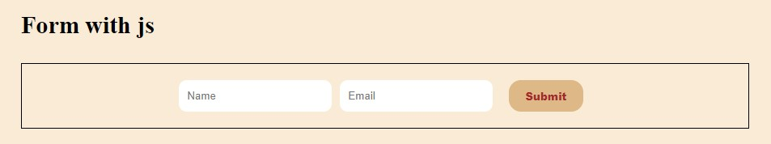
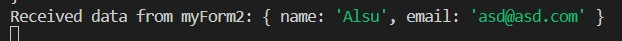
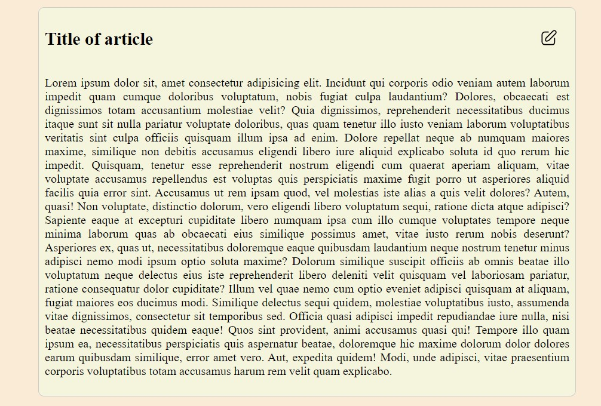
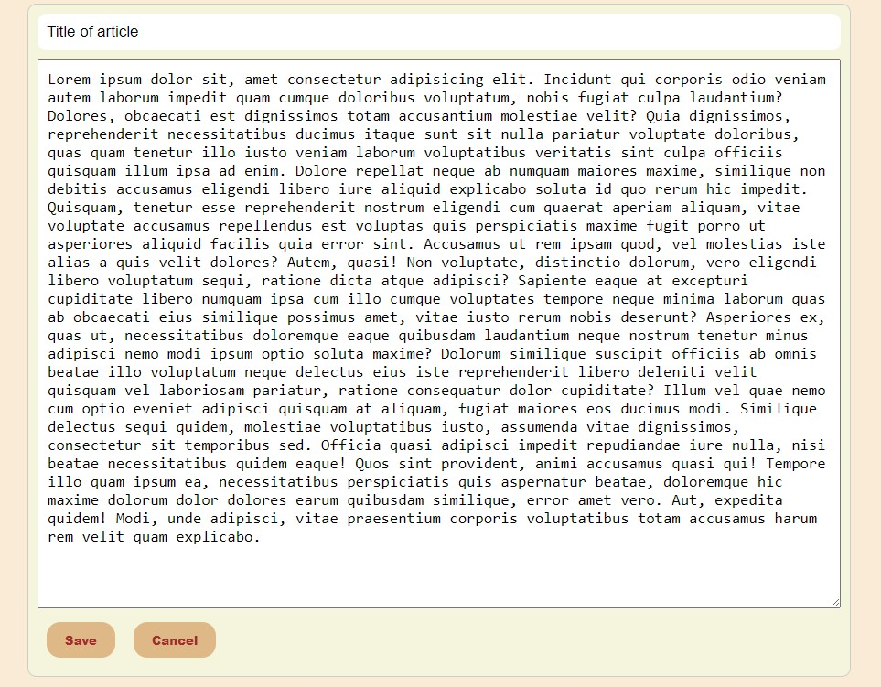

# sendDataFeBe
The project features frontend and backend and contains:
a simple form that sends data to the server

received date on the server:

article with the ability to edit and save data

# to start the project:
1. open terminal in VS Code
2. go to folder be: cd be
3. install npm: npm install
4. open index.html in File Explorer
